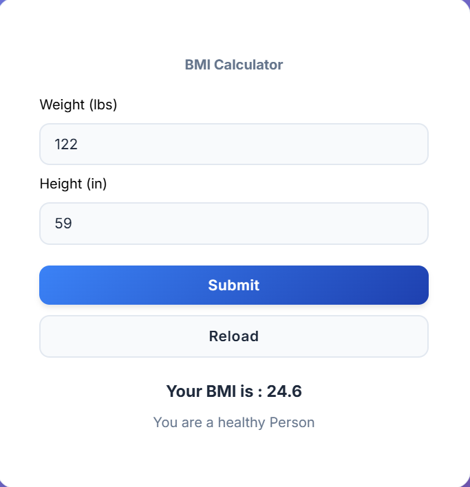

# 🧮 React BMI Calculator


A simple and beginner-friendly **BMI (Body Mass Index) Calculator** built using **React**.  
This project helps users calculate their BMI and understand their health category.

---

## 🚀 Features

- ✔ Input height and weight
- ✔ Instant BMI calculation
- ✔ Displays BMI category (Underweight, Normal, Overweight, etc.)
- ✔ Clean and responsive UI
- ✔ Built with React (functional components)

---

## 📌 Tech Stack

- React.js
- HTML5
- CSS3

---

## 📊 How BMI is Calculated

```
BMI = weight (lbs) / (height (in) × height (in) * 703)
```

## 📷 Project Preview



---

## 🔧 Installation & Setup

1. Clone the repository:
```bash
git clone https://github.com/aarav12e/bmi_cal.git
```

2. Navigate to the project folder:
```bash
cd bmi_cal
```

3. Install dependencies:
```bash
npm install
```

4. Run the app:
```bash
npm start
```

---

## 🌐 Live Demo

https://bmi-cal-mauve.vercel.app/

---

## 📁 Project Structure

```
bmi_cal/
│── src/
│   ├── App.js
│   ├── App.css
│   └── index.css
│── public/
└── package.json
```

---

## 💡 Future Improvements

- Add unit conversion (cm/feet, kg/lbs)
- Better UI/UX design
- Save previous BMI results

---

## 🙌 Contributing

Feel free to fork this repo and improve it!

---

## ⭐ Support

If you like this project, give it a ⭐ on GitHub!

for youtube


